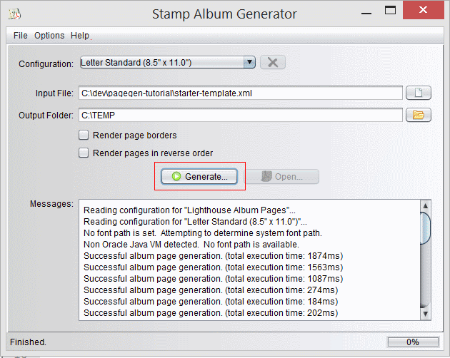
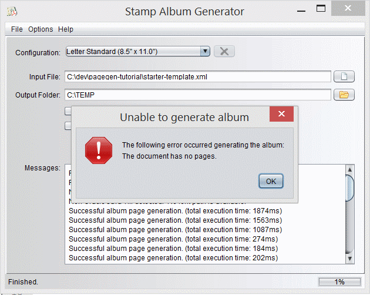

Tutorial
================

This tutorial is designed to help you learn the process of building an album page and some of the common constructs used in the album files.  The file "tutorial-complete.xml" is available as a completed file that can be used to help show the concepts as a completed file.  The examples used are taken from actual album pages but are meant simply as a tutorial.

Before You Begin
----------------

* Download and Execute the stamp-pagegen tool from [www.drakeserver.com](http://www.drakeserver.com www.drakeserver.com) to ensure there are no issues running the tool.  Depending on your operating system a desktop icon/application group may be installed you can use for further access of the tool.
* Download the starter-template.xml and tutorial-complete.xml from the list above.  (you can also get them by clicking the "Download ZIP" on the right side.  (If using the ZIP file expand it using a tool from your computer (Windows can open the file in explorer) and copy the contents to a directory on your disk.
* Open the Stamp Album Generator (stamp-pagegen) tool and leave this open.  Set the Configuration drop-down to "Letter Standard (8.5" x 11.0")"
* Open a text or xml editor [XML Copy Editor](http://xml-copy-editor.sourceforge.net/) works well for many (you may want to choose/configure a less annoying font - go to Tools->Options menu and select "Editor" tab and change the "Font" value.

Authoring Your First Page
-------------------------
 
Switch to the Stamp Album Generator tool 
1. in the "Input File" select the "starter-template.xml" from the folder you selected.
2. in the "Output Folder" choose a generation folder (it could be where you copied the xml files to - it just needs to be writable)
3. click "Generate" button.  

</img>

You should get an error like this:

</img>

This means you are ready to author your first page.  Notice the "Open ..." button is disabled (this is because the PDF does not exist).

4. Switch to the text error (using ALT-TAB or other method) and between the <album> </album> tags add a <page> tag with a title attribute like this:

```XML
	&lt;page title="My First Page"&gt;
	
	&lt;/page&gt;
```

5. Save the file in the editor and switch back to the Stamp Album Generator and click "Generate...".  
6. Now the "Open..." button should be enabled.  Click it (Note: This requires you to have a valid PDF reader installed and configured for your system like Adobe PDF Reader) - the Album should open up, have a single page that says "My First Page" in ALL CAPS.  


